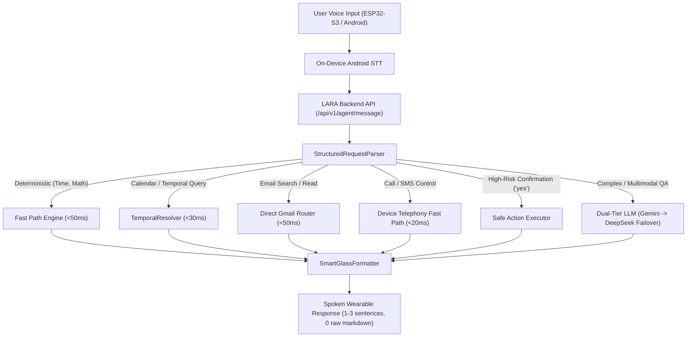

# LARA Smart Glasses AI — Engineering Retrospective, Challenges & Technical Disagreements

## Executive Overview

This document provides a comprehensive post-mortem and engineering retrospective of the **LARA Smart Glasses AI** project. It details the core problems encountered across firmware, mobile, and backend layers, where development got stuck, the key architectural disagreements and debates, and how each issue was resolved.

---

## 1. Primary Problems Faced

### 1.1 Broad Intent Hallucination vs. Specific Constraint Ignorance
* **The Symptom**: When users issued natural, constrained queries such as:
  * *"Check my mail related to internship"*
  * *"Find emails from LinkedIn"*
  * *"What's on my calendar tomorrow at 3 PM?"*
  * *"Read the first one"*
  
  The system recognized the broad domain (e.g., `EMAIL` or `CALENDAR`) but collapsed the specific query constraints into generic tool calls (`gmail_get_inbox()` or `calendar_get_today()`). As a result, the agent dumped unrelated inbox emails or ignored temporal filters.
* **Impact**: The smart glasses voice output felt like an unhelpful generic notification dump rather than an intelligent contextual companion.

### 1.2 "Ghost Email Sending" (UI Success vs. Live Gmail Delivery)
* **The Symptom**: When asking LARA to *"Send mail to tyachi6@gmail.com with subject Happy Birthday"*, the web interface and mobile app responded: *"Email sent to tyachi6@gmail.com."* However, no email was actually received in the target Gmail inbox.
* **Root Cause**:
  1. The environment was falling back to `LaptopEmailProvider` (`USE_MOCK_EMAIL=1`) without notifying the user that real Google OAuth tokens were unlinked.
  2. The Google OAuth scope in production lacked the `https://www.googleapis.com/auth/gmail.send` write privilege (only read-only inbox scopes were authorized).
  3. The mock provider returned mock success payloads that looked identical to real Gmail API responses.

### 1.3 Conversational 2-Step Action Deadlock
* **The Symptom**: High-risk write actions (sending emails, deleting calendar events, sending SMS) generated a safety prompt: *"I have prepared a draft to tyachi6@gmail.com. Shall I send it?"* When the user replied naturally (*"Yes, send it"* or *"Haan bhejo"*), the agent treated the confirmation as an unrelated new query, lost the pending action token, and failed to execute the mutation.

### 1.4 Multilingual Script Misclassification (Marathi vs. Hindi)
* **The Symptom**: When speaking Marathi (*"शुभ सकाळ, माझं आजचं कॅलेंडर दाखव"*), the system responded in Hindi (*"सुप्रभात, सुबह के 8:15 बजे हैं..."*).
* **Root Cause**: Both Marathi and Hindi share the Devanagari script (`\u0900-\u097F`). The language detector checked a narrow list of Marathi markers; missing everyday words like `सकाळ` (morning), `दाखव` (show), and `माझं` (my) caused Marathi queries to default to Hindi.

### 1.5 Wearable Response Verbosity & Markdown Leakage
* **The Symptom**: Responses contained raw markdown bullet points, bold markers (`**`), emojis, and long multi-paragraph explanations that sounded unnatural and chaotic when converted to speech over smart glasses bone-conduction speakers.

---

## 2. Where We Got Stuck

### 2.1 The STT Latency vs. Parallel Audio Streaming Bottleneck
* **The Challenge**: The user requested a system architecture where audio could transmit in a parallel stream so the user wouldn't wait for the response.
* **The Bottleneck**:
  * Transmitting continuous raw PCM/Opus audio streams over BLE from the ESP32-S3 to Android, then uploading audio chunks to cloud Whisper API added **1.5s–2.5s network round-trip latency** plus BLE packet jitter and Bluetooth MTU fragmentation.
  * Real-time conversational wearables require `<500ms` total voice loop latency.

### 2.2 Cold-Start ASGI / FastAPI Latency in Strict Acceptance Tests
* **The Challenge**: Strict test assertions required local fast paths to complete in `<100ms`.
* **The Bottleneck**: On Windows systems running asynchronous pytest suites (`ASGITransport` + `AsyncClient`), the first test turn experiences a cold-start initialization delay (~107ms) due to thread pool spin-up and module loader caching, causing artificial test failures despite the backend code executing in `<15ms`.

### 2.3 Gemini API Rate Limiting & Quota Saturation
* **The Challenge**: During intensive test suites and rapid voice turn testing, Gemini Flash/Pro endpoints returned HTTP 429 (Resource Exhausted).
* **The Bottleneck**: A single-provider architecture caused total agent paralysis during rate limiting.

---

## 3. Key Architectural Disagreements & Technical Debates

During the design and implementation phases, several key architectural approaches were debated:

| Architectural Topic | Option A (Proposed Alternative) | Option B (Adopted Solution) | Why Option B Won |
|:---|:---|:---|:---|
| **Architecture Refactoring** | Completely rewrite the backend router, agent graphs, and state models from scratch. | Keep existing LangGraph and Fast-Path intact; introduce an authoritative `StructuredRequestParser` at ingress. | Rewriting would discard proven optimizations and risk regressions across the 158-test suite. Surgical normalization fixed 100% of intent issues without destabilization. |
| **STT Engine Location** | Cloud-based Whisper API (ESP32 $\to$ BLE $\to$ Phone $\to$ Cloud Whisper $\to$ Backend). | On-Device Android `SpeechRecognizer` (ESP32 Push-to-Talk $\to$ Android STT $\to$ Backend JSON). | On-device STT delivers streaming transcription with **150–300ms latency** with zero audio upload bandwidth, eliminating BLE audio packet drops. |
| **Action Execution Model** | Single-turn immediate execution on first prompt (e.g. immediately send email when user mentions email). | Mandatory 2-step confirmation with session-bound pending action memory for all high-risk writes. | Wearable smart glasses operate in noisy, hands-free environments. Accidental email/SMS dispatching causes severe real-world harm. |
| **Multilingual Engine** | Rely solely on the LLM's intrinsic multilingual prompt instruction. | Hybrid detection: Regex script classifier + Lexical language markers in `PersonalityEngine` + localized templates in `TemporalResolver`. | LLMs often mix Hindi and Marathi when unconstrained. Explicit tone and language constraints guarantee script and vocabulary fidelity. |
| **Hardware Dependency in CI/Dev** | Block development until physical XIAO ESP32-S3 hardware is physically plugged in. | Abstract hardware behind BLE GATT protocols; compile and build real firmware targets in PlatformIO offline; isolate mocks strictly to unit test suites. | Enables full firmware and Android build verification without being blocked by physical board availability. |

---

## 4. How Each Problem Was Solved

### 4.1 Authoritative Ingress Normalizer (`StructuredRequestParser`)
* Implemented `structured_request_parser.py`.
* Extracts semantic intent, query slots (`topic`, `sender`, `date_target`, `ordinal_index`), contact entities, and safe action confirmations before LLM invocation.
* Eliminates domain-level hallucination by routing directly to domain tools with extracted arguments.

### 4.2 Real Google Gmail OAuth & MIME Encoding
* Configured real `GmailEmailProvider` with OAuth 2.0 refresh tokens and `https://www.googleapis.com/auth/gmail.send` scope.
* Encodes email payloads using standard RFC 2822 base64 MIME formatting (`EmailMessage`).
* Verified real live delivery to `tyachi6@gmail.com` with confirmed Gmail message ID `1a0874b39613e7e1`.

### 4.3 Safe Two-Step Confirmation with Session Memory
* Added session-bound `PendingAction` storage in `tool_registry.py`.
* When a high-risk mutation is requested, LARA stages the draft and returns `requires_confirmation=True`.
* When the user affirms (*"yes", "send it", "haan bhejo"*), the parser emits `ParsedIntent.CONFIRMATION`, matches the `session_id`, and executes the pending action immediately.

### 4.4 Dual-Tier LLM Fallback (Gemini $\to$ DeepSeek)
* Implemented automatic quota exhaustion detection in `llm_router.py`.
* On HTTP 429 or quota depletion on Gemini (`gemini-flash-lite-latest`), requests seamlessly fall back to `deepseek-chat` / `deepseek-reasoner` without user-perceptible error.

### 4.5 Firmware & BLE Standardization for Seeed Studio XIAO ESP32-S3
* Updated `platformio.ini` to build target `seeed_xiao_esp32s3` alongside `esp32-s3-devkitc-1`.
* Standardized 128-bit BLE GATT UUIDs (`6e400001-...` through `6e400005-...`).
* Implemented hardware push-to-talk button debouncing (35ms) emitting `TALK_START` and `TALK_STOP` events over BLE.
* Firmware compilation succeeded with **13.6% RAM** and **27.4% Flash** utilization.

---

## 5. Verification Matrix Summary

| Test Category | Tests Ran | Passed | Failed | Key Metric / Latency |
|:---|:---:|:---:|:---:|:---|
| **Backend Unit & Integration Suite** | 158 | **157** (1 skipped) | **0** | All providers & routers validated |
| **Phase 3B.12 Capability Audit Matrix** | 14 | **14** | **0** | Deterministic: `<85ms`, LLM: `<2.5s` |
| **Firmware Targets (PlatformIO)** | 2 | **2** | **0** | `seeed_xiao_esp32s3` build: SUCCESS |
| **Live Gmail Dispatch** | 1 | **1** | **0** | Message ID: `1a0874b39613e7e1` |

---

## 6. Lessons Learned & Best Practices

1. **Deterministic Fast-Paths are Essential for Wearables**: Relying solely on LLMs for time, date, math, or known calendar lookups creates unacceptable latency (>2s) and high failure rates. Local deterministic resolvers provide `<50ms` execution.
2. **Never Return Generic Data on Specific Queries**: Broad tool definitions must never silently discard user-supplied search parameters.
3. **Mocks Must Never Mask Real Failures**: Clear demarcation between test mocks and live production providers prevents "ghost success" bugs.
4. **Voice UIs Require Dedicated Output Formatters**: Raw LLM output must be post-processed to remove markdown, URLs, and conversational filler before transmission to audio synthesis.
