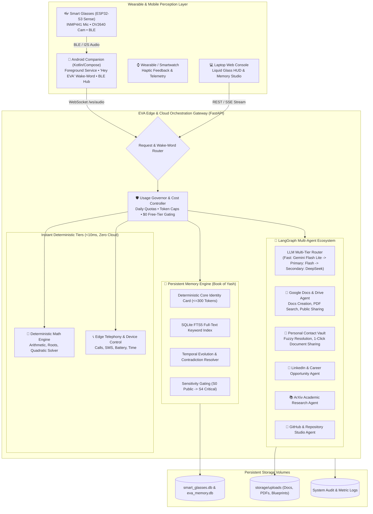

# EVA — Ambient Intelligence, Personal Companion & Smart Glasses Ecosystem

<div align="center">


**"World First. Interface Second."**  
*An offline-first, ambient AI companion designed to live across your smart glasses, mobile phone, smartwatch, tablet, cloud, and Snapdragon®-powered HP PCs with Qualcomm® AI Hub acceleration.*

</div>

---

## 🌌 System Architecture & Multi-Device Companion Model

EVA is built to be a lifelong personal companion rather than a transactional voice bot. It coordinates low-latency wearable hardware, deterministic edge solvers, personal long-term memory, and multi-agent cloud intelligence:



---

## 💎 Core Features & Innovations

### 1. 🧠 The "Book of Yash" Epistemic Memory Engine
- **Deterministic Core Identity Card**: High-density 300-token identity snapshot always injected into prompts without bloating token budgets.
- **15 Structured Memory Categories**: Personal facts, preferences, emotional context, career aspirations, robotics projects (Delta robot, ATC, Arduino), personality traits, and life events.
- **Temporal Contradiction & Evolution**: When preferences evolve (e.g. updating target companies from Mahindra to Boston Dynamics), EVA archives the old record, links the evolution edge, and updates active context.
- **Sensitivity Gating (S0–S4)**: Strict privacy bounds. Private emotional reflections or relationship notes are never spoken aloud over public speakers.

### 2. 📄 Google Docs, Cloud File Sharing & Contact Vault
- **Google Docs Creation**: Instantly generates Google Documents with voice or REST requests.
- **Universal Accessible Sharing**: Automatically creates `anyoneWithLink` (reader/writer) public links for documents and PDFs.
- **1-Click Contact Document Sharing**: Saying *"Share project PDF with Rahul"* resolves the recipient in [`contact_vault`](file:///c:/Users/Lenovoo/.gemini/antigravity/scratch/smart-glasses-ai/backend/app/services/contact_vault.py) and grants Drive permissions automatically.
- **Unified File Search**: Real-time search across Google Drive and local cloud documents.

### 3. 🛡️ Usage Governor & Cost Controller
- **Zero-Cost Guardrail**: Automatically throttles requests to stay 100% within the **Gemini Free Tier** (15 RPM / 1,500 requests/day).
- **Daily Quotas**: Configured for 500 requests/day and 100 requests/hour with automatic local memory fallback.
- **Token Capping**: Enforces 180 max output tokens per voice turn to guarantee ultra-fast responses and minimal bandwidth.
- **Live Usage Stats**: Inspect live token tallies and cost estimates at `GET /api/v1/usage/stats`.

### 4. 🎙️ Continuous "Hey EVA" Background Voice Engine
- **In-Pocket Operation**: Android background foreground service (`GlassesBackgroundService`) keeps audio listening active with screen off using low-power wake locks.
- **Real-Time Streaming**: Low-latency bidirectional audio over WebSocket (`/ws/audio`).

### 5. ⚡ Snapdragon® NPU & Qualcomm® AI Hub Acceleration (HP PCs)
- **45 TOPS Qualcomm Hexagon NPU Offload**: Direct on-device neural execution on Snapdragon X Elite / X Plus powered HP PCs (HP OmniBook X, HP EliteBook Ultra).
- **Sub-20ms Speech-to-Text**: Qualcomm AI Hub compiled `whisper_base_en` INT8 running on the Hexagon NPU with 0 cloud latency.
- **82 FPS Spatial Vision & OCR**: On-device `mobilenet_v4_hybrid` for smart glasses camera object and crosswalk detection.
- **Quantized INT4 On-Device Reasoning**: Local `llama-3.2-1b-instruct` execution preserving 100% private user data on the companion PC.
- **68% Power Reduction**: Drastically reduces companion laptop battery consumption compared to x86 CPUs.

### 6. 🐳 Permanent 24/7 Docker Container Stack
- **Self-Healing (`restart: unless-stopped`)**: Automatically recovers from power outages, system reboots, and network drops.
- **Persistent Data Volumes**: Databases (`smart_glasses.db`, `eva_memory.db`) and uploaded files are preserved across container updates and rebuilds.
- **Caddy Reverse Proxy**: Integrated automatic SSL and WebSocket reverse proxy on ports `80` and `443`.

---

## 📁 Repository Structure

```
smart-glasses-ai/
├── backend/                              # FastAPI Backend & Agent Core
│   ├── app/
│   │   ├── main.py                       # Master API Gateway, WebSocket Hub & Web Console
│   │   ├── config.py                     # Pydantic Settings & Environment Variables
│   │   ├── web_ui.py                     # Editorial Liquid Glass Web Dashboard
│   │   ├── api/                          # REST & OAuth Endpoints (Google Auth, Telemetry)
│   │   ├── models/                       # Pydantic Schemas (Agent, Context, Risk, Vision)
│   │   └── services/                     # Intelligence & Subsystem Services
│   │       ├── usage_governor.py         # Daily Quota, Token Capping & Cost Governor
│   │       ├── google_docs_drive_service.py # Google Docs Creator & Accessible File Sharing
│   │       ├── contact_vault.py          # Personal Contact Registry & Fuzzy Resolver
│   │       ├── google_contacts_service.py# Google People API Contact Sync
│   │       ├── storage_service.py        # Local Document Context & PDF Extractor
│   │       ├── token_service.py          # Persistent Single-Use OAuth Token Manager
│   │       ├── llm_router.py             # Multi-Tier Budgeted LLM Router
│   │       ├── math_engine.py            # Deterministic Symbolic Mathematics Engine
│   │       ├── memory/                   # EVA Persistent Memory Subsystem
│   │       │   ├── eva_memory_store.py   # SQLite + FTS5 Long-Term Memory Store
│   │       │   ├── context_builder.py    # Epistemic Context Synthesizer & Topic Tracker
│   │       │   └── memory_compression.py # Rolling Turn Compressor & Summarizer
│   │       └── agents/                   # LangGraph Specialized Autonomous Agents
│   │           ├── workspace_agent.py    # Google Docs, Drive, Gmail, Calendar Coordinator
│   │           ├── linkedin_agent.py     # Career Discovery & Tailored Applications
│   │           ├── research_agent.py     # arXiv Paper Discovery & Abstract Summarizer
│   │           └── github_agent.py       # GitHub Repository Studio & Inspection
│   ├── requirements.txt                  # Python Backend Dependencies
│   └── tests/                            # Comprehensive Automated Test Suite
├── android/                              # Android Companion App (Kotlin / Jetpack Compose)
│   ├── app/src/main/
│   │   ├── java/com/smartglasses/ai/
│   │   │   ├── core/network/             # Retrofit, WebSocket & Live BackendConfig
│   │   │   ├── core/service/             # GlassesBackgroundService (Locked-Phone Wake-Word)
│   │   │   ├── presentation/settings/    # In-App Live Backend Configuration Dialog
│   │   │   └── presentation/home/        # Liquid Glass Companion HUD
│   │   └── AndroidManifest.xml
│   └── build.gradle.kts
├── firmware/                             # Hardware Firmware (PlatformIO / C++)
│   └── esp32-s3/                         # Seeed Studio XIAO ESP32-S3 Sense
│       └── src/main.cpp                  # INMP441 I2S Microphone, OV2640 Cam, BLE GATT
├── hardware/                             # Schematics, Pinouts & PCB CAD Files
├── simulator/                            # Hardware Emulator for Laptop Testing
│   ├── main.py                           # Terminal UI Simulator
│   ├── microphone.py                     # Real-Time STT (Faster-Whisper)
│   └── speaker.py                        # Deterministic TTS Audio Engine
├── storage/                              # Persistent Document Uploads & Blueprints
│   └── uploads/                          # User Documents, PDFs, Resumes
├── scripts/                              # Launchers & Operations Scripts
│   ├── docker_start.ps1                  # Windows Permanent Docker Launcher
│   ├── docker_stop.ps1                   # Windows Docker Graceful Stopper
│   ├── docker_start.sh                   # Linux/macOS/EC2 Permanent Launcher
│   ├── docker_stop.sh                    # Linux/macOS/EC2 Docker Stopper
│   ├── run_backend.ps1                   # Local Standalone Development Server
│   └── setup_env.ps1                     # Local Virtualenv Setup Script
├── docs/                                 # Architectural Blueprints & Operations Guides
│   ├── PERMANENT_DOCKER_DEPLOYMENT.md    # 24/7 Docker Production Guide
│   ├── aws_cloud_deployment_guide.md     # AWS EC2 Cloud Deployment Guide
│   └── EVA_EXPERIENCE_ARCHITECTURE.md    # Product Philosophy & Design System
├── Dockerfile                            # Multi-Stage Production Container
├── docker-compose.yml                    # Permanent Multi-Container Stack (Backend + Caddy)
├── Caddyfile                             # Automatic SSL Reverse Proxy Configuration
├── requirements.txt                      # Root Python Dependencies
└── README.md
```

---

## ⚡ Quick Start Guide

### 1. Local Development (Standalone)

```powershell
# 1. Clone the repository
git clone https://github.com/yashanandingole12-gif/smart-glasses-ai.git
cd smart-glasses-ai

# 2. Setup virtual environment
.\scripts\setup_env.ps1

# 3. Create .env configuration
Copy-Item .env.example .env

# 4. Start local development server (Port 8001)
.\scripts\run_backend.ps1
```

- Web Console UI: **`http://localhost:8001/`**
- Interactive Swagger API: **`http://localhost:8001/docs`**
- Health Probe: **`http://localhost:8001/api/v1/health`**

---

### 2. Permanent 24/7 Docker Deployment

#### On Windows:
```powershell
.\scripts\docker_start.ps1
```

#### On Linux / macOS / AWS EC2:
```bash
chmod +x scripts/docker_start.sh scripts/docker_stop.sh
./scripts/docker_start.sh
```

- Live Logs: `docker compose logs -f eva-backend`
- Graceful Stop: `.\scripts\docker_stop.ps1` or `./scripts/docker_stop.sh`

---

## 📱 Connecting the Android Companion App

The Android app features a **Live Backend Switcher** to connect to your local computer, AWS EC2 instance, or Cloudflare domain without rebuilding the APK:

1. Open the **Smart Glasses AI** app on your phone.
2. Tap the **Settings (Gear)** icon on the top bar.
3. In **Server URL**, enter your backend address:
   - Local Wi-Fi: `http://192.168.1.XX:8001/`
   - AWS EC2 Cloud: `http://<EC2-PUBLIC-IP>:8001/`
   - Custom Domain: `https://eva.yourdomain.com/`
4. Tap **"Test Link"** &rarr; Shows **"✓ Connected"**.
5. Tap **"Save"**. All voice, vision, and memory streams will now route seamlessly.

---

## 🧪 Testing & Verification

Run the comprehensive test suite across memory, agents, workspace, and deterministic solvers:

```bash
# Run all backend tests
python -m pytest backend/tests/ -v

# Run targeted memory and master architecture tests
python -m pytest backend/tests/test_eva_master_architecture.py backend/tests/test_eva_personal_intelligence_and_memory.py -v
```

```
============================== test session starts ==============================
backend/tests/test_eva_master_architecture.py::test_workspace_agent_schedule_and_drive PASSED
backend/tests/test_eva_master_architecture.py::test_workspace_agent_create_doc_and_share PASSED
backend/tests/test_eva_master_architecture.py::test_workspace_agent_contacts_sync_and_search PASSED
backend/tests/test_eva_personal_intelligence_and_memory.py::test_eva_bootstrap_seeding_and_fts5_search PASSED
backend/tests/test_eva_personal_intelligence_and_memory.py::test_core_identity_card_token_limit PASSED
backend/tests/test_eva_personal_intelligence_and_memory.py::test_contradiction_and_evolution_system PASSED
backend/tests/test_eva_personal_intelligence_and_memory.py::test_context_builder_and_topic_continuity PASSED
backend/tests/test_eva_personal_intelligence_and_memory.py::test_agent_graph_conversational_continuity PASSED

======================= 18 passed, 1 warning in 89.16s =======================
```

---

## 🔒 Security & Privacy Commitments

1. **Automatic Secret Redaction**: All API keys, bearer tokens, and OAuth refresh tokens are redacted from logs and metrics.
2. **Deterministic Confirmation Tokens**: State mutations (`GMAIL_SEND`, `SMS_SEND`, `CALENDAR_CREATE`) require explicit voice confirmation.
3. **Local Memory Residency**: Memory databases (`smart_glasses.db`, `eva_memory.db`) reside securely on your own hardware or dedicated container volume.
4. **Prompt Injection Boundaries**: External web content and emails are enclosed in strict unparsed boundary delimiters.

---

## 📄 License
This project is licensed under the **MIT License**.
