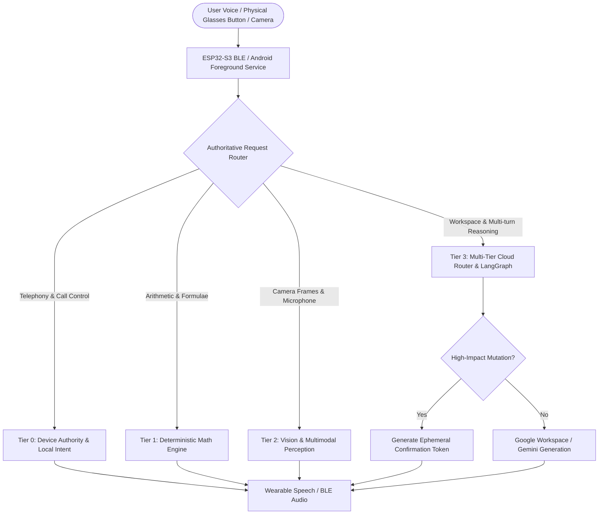

# LARA Smart Glasses — Context-Aware AI Wearable Ecosystem


**LARA (Local & Augmented Reasoning Assistant)** is a context-aware smart glasses ecosystem engineered for hands-free intelligence, edge-authoritative offline telephony, deterministic math solving, multimodal vision perception, and Google Workspace integration.

---

## 🏛️ System Architecture & 4-Tier Execution Model

LARA employs a strict 4-tier execution hierarchy that guarantees instant deterministic execution (<10ms) for critical device functions while routing complex multi-turn reasoning to cloud models with hard latency budgets:



### 1. Tier 0 — Device Authority & Local Control (<10ms, Zero-Cloud)
- **Direct Telephony:** Phone calls (`call_make`, `call_answer`, `call_reject`, `call_hangup`), SMS broadcasts, battery checks, and local system time.
- **In-Pocket Operation:** Maintained by the Android Background Companion Service with persistent foreground notification and `WAKE_LOCK`.

### 2. Tier 1 — Deterministic Math & Symbolic Evaluation (<10ms, Zero-LLM)
- **Symbolic Parser (`DeterministicMathEngine`):** Handles arithmetic, percentages, fractions, square/cube roots, reciprocals, multiplication tables, and quadratic equations.
- **Zero Hallucination:** Eliminates LLM calculation errors and produces instant spoken results.

### 3. Tier 2 — Vision & Multimodal Perception (<100ms Local / <1.5s Cloud)
- **Hardware Capture:** XIAO ESP32-S3 Sense OV2640/OV3660 camera snapshots and MSM261D PDM digital microphone energy telemetry.
- **Visual Intelligence:** Real-time QR code decoding, OCR math equation solving, SHA-256 frame integrity checks, and Gemini Multimodal Vision scene understanding.

### 4. Tier 3 — Cloud Reasoning & Google Workspace (<1.5s Budget)
- **Multi-Tier Cascade:** `FAST` (Gemini Flash Lite) -> `PRIMARY` (Gemini Flash) -> `SECONDARY` (DeepSeek V3) -> `FALLBACK` (Mock/Local).
- **Google Workspace Integrations:** Gmail (Search, Read, Compose), Google Calendar (Query, Conflict detection, Creation), and Google People API (Contacts sync).
- **2-Step Confirmation Security Gate:** Mutating actions (`GMAIL_SEND`, `CALENDAR_CREATE`, `SMS_SEND`) are gated with single-use 60-second confirmation tokens.

---

## ⚡ Offline vs. Online Capabilities

| Capability | Offline (On-Device / Zero Cloud) | Online (Cloud & Workspace Connected) |
|---|:---:|:---:|
| **Phone Calls & Contacts** | ✅ Exact voice dial (`"Call Rahul"`) | ✅ Google Contacts sync |
| **Mathematics & Calculations** | ✅ Exact symbolic computation (`125 * 375`) | ✅ Advanced step-by-step reasoning |
| **Quadratic Equations** | ✅ Real-time solver (`x^2 + 5x + 6 = 0`) | ✅ Multimodal visual equation solver |
| **System Telemetry** | ✅ Battery, Time, Date, Mic RMS energy | ✅ Cloud latency metrics & diagnostics |
| **Vision & Object Recognition** | ✅ QR decoding & frame integrity verification | ✅ Multimodal scene understanding |
| **Communication & Schedule** | ✅ In-pocket SMS reception & alerts | ✅ Gmail read/send & Google Calendar edits |
| **Web & Research** | ❌ Requires internet | ✅ arXiv search & Web knowledge retrieval |

---

## 📁 Repository Structure

```
smart-glasses-ai/
├── backend/                  # FastAPI Application & Orchestration Backend
│   ├── app/
│   │   ├── main.py           # Authoritative Request Router & Web Dashboard
│   │   ├── config.py         # Pydantic Settings & Environment Configuration
│   │   ├── models/           # Pydantic Schemas (Agent, Context, Risk, Vision)
│   │   └── services/         # Core Services & Subsystems
│   │       ├── agent_graph.py              # LangGraph Stateful Agent & Checkpointer
│   │       ├── llm_router.py               # Multi-Tier Cloud Router with Deadlines
│   │       ├── llm_service.py              # Gemini, DeepSeek & Mock Providers
│   │       ├── math_engine.py              # Deterministic Symbolic Math Engine
│   │       ├── contact_vault.py            # Local Contact Storage & Resolution
│   │       ├── temporal_resolver.py        # Calendar & Temporal Reasoning
│   │       ├── structured_request_parser.py# Intent Parsing & Entity Extraction
│   │       ├── device_security_service.py  # Audit Logging & Risk Token Lifecycle
│   │       ├── vision_service.py           # Frame Validation & Vision Engine
│   │       └── hardware_bridge.py          # ESP32-S3 Camera/Mic Telemetry Bridge
│   └── requirements.txt      # Backend Dependencies
├── android/                  # Android Companion Mobile Application (Kotlin / Compose)
│   └── app/src/main/
│       ├── java/com/smartglasses/ai/
│       │   ├── service/BackgroundCompanionService.kt  # Locked-Phone Foreground Service
│       │   ├── ble/BleManager.kt                     # Bluetooth LE GATT Communication
│       │   └── ui/                                   # Jetpack Compose Wearable Screens
│       └── AndroidManifest.xml
├── firmware/esp32-s3/        # Seeed Studio XIAO ESP32-S3 PlatformIO Firmware
│   └── src/
│       ├── main.cpp          # BLE Server, PDM Mic (I2S), OV2640 Driver
│       └── gatt_profile.h    # Custom BLE UUIDs & Packet Protocols
├── simulator/                # Laptop Smart Glasses Simulator
│   ├── main.py               # Hardware-equivalent Terminal UI Simulator
│   ├── microphone.py         # Real-time Speech-to-Text (STT)
│   ├── speaker.py            # Deterministic Text-to-Speech (TTS)
│   └── camera.py             # Webcam Snapshot Capture
├── scripts/                  # Automation & Testing Utilities
│   ├── run_acceptance_tests.py # Master 7-Test Acceptance Runner
│   ├── setup_env.ps1         # Environment Setup Script
│   └── run_backend.ps1       # Backend Launch Script
├── tests/                    # 163 Pytest Unit & Integration Tests
├── AUDIT_REPORT.md           # Systems Audit & Acceptance Report
└── README.md
```

---

## 🚀 Quick Start Guide

### 1. Prerequisites
- **Python 3.11+** (Python 3.13 verified)
- **Microphone, Speakers & Webcam** (for simulator mode)
- *(Optional)* **Seeed Studio XIAO ESP32-S3 Sense** & Android device (API 26+)

### 2. Environment Setup
Clone the repository and install dependencies:
```bash
git clone https://github.com/yashanandingole12-gif/smart-glasses-ai.git
cd smart-glasses-ai

# Install dependencies
pip install -r backend/requirements.txt
pip install -r simulator/requirements.txt
```

Create a `.env` file in the project root:
```ini
LLM_PROVIDER=gemini
LLM_MODEL=gemini-flash-lite-latest
GEMINI_API_KEY=your_gemini_api_key_here

# Secondary Fallback
SECONDARY_LLM_PROVIDER=deepseek
DEEPSEEK_API_KEY=your_deepseek_api_key_here

HOST=127.0.0.1
PORT=8001
DEBUG=true
```

### 3. Run the FastAPI Backend
```bash
uvicorn backend.app.main:app --host 127.0.0.1 --port 8001 --reload
```
- Open the Developer Dashboard: **`http://127.0.0.1:8001`**
- API Health Check: **`http://127.0.0.1:8001/api/v1/health`**

### 4. Run the Laptop Glasses Simulator
In a separate terminal:
```bash
python simulator/main.py
```
- Press **ENTER** (or **SPACE**) to simulate the physical glasses button.
- Speak naturally: *"What is 125 times 375?"* or *"What meetings do I have tomorrow?"*

---

## 🧪 Verification & Automated Testing

### Run All 163 Pytest Unit & Integration Tests
```bash
python -m pytest -v tests
```

### Run the 7 Master Acceptance Tests
```bash
python scripts/run_acceptance_tests.py
```

```
================================================================================
      LARA SMART GLASSES -- MASTER ACCEPTANCE TEST SUITE (7 TESTS)        
================================================================================

[TEST 1/7] Offline Mathematics (Zero-Cloud / Zero-LLM) -> PASS (5.93 ms)
[TEST 2/7] Offline Phone Control (Call Rahul)          -> PASS (6.31 ms)
[TEST 3/7] Gmail Integration (Search)                  -> PASS (5014.49 ms)
[TEST 4/7] Gmail Send (Confirmation Token Gate)        -> PASS (7435.29 ms)
[TEST 5/7] Calendar Multi-Turn Query & Modification    -> PASS (4126.90 ms)
[TEST 6/7] Camera -> Vision -> TTS Pipeline            -> PASS (47.73 ms)
[TEST 7/7] Locked Phone Hands-Free Operation           -> PASS (1796.35 ms)

[ALL 7 ACCEPTANCE TESTS PASSED WITH ZERO ERRORS]
```

---

## 🔒 Security & Privacy Invariants

1. **Zero Secret Logging:** OAuth access tokens, refresh tokens, and API credentials are automatically redacted across all loggers, metrics, and WebSocket endpoints.
2. **Deterministic Confirmation Tokens:** State mutations (`GMAIL_SEND`, `SMS_SEND`, `CALENDAR_CREATE`) require explicit voice confirmation. Tokens expire after 60 seconds and cannot be reused.
3. **Strict Injection Boundaries:** External content from web searches or emails is delimited with `<<<UNTRUSTED_EXTERNAL_CONTENT>>>` tags before passing to language models.
4. **Local Data Residency:** Local contacts, session memory, and deterministic math calculations never leave the user's device.

---

## 📄 License
This project is licensed under the MIT License.
