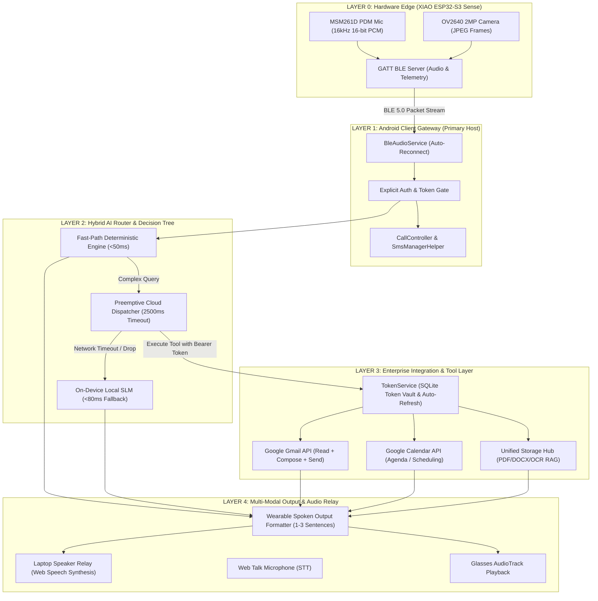

# EVA Smart Glasses AI — System Architecture & Layer Infographic

---

## 1. Architectural Overview & Design Philosophy

The **EVA Smart Glasses AI System** is engineered as a **5-Layer Intelligent Wearable Computing Stack**. It combines edge sensor capture on the **Seeed Studio XIAO ESP32-S3 Sense**, native hardware mediation on **Android**, sub-50ms deterministic edge routing, resilient **LangGraph/Gemini 2.5 Flash** agent orchestration in the cloud, and real-time multi-modal audio relay on both the glasses and laptop speakers.



---

## 2. 5-Layer Deep-Dive Breakdown

### Layer 0: Hardware Edge Subsystem (XIAO ESP32-S3 Sense)
- **SoC**: Dual-core 32-bit Xtensa LX7 @ 240 MHz, 8MB PSRAM, 8MB Flash.
- **Audio Capture**: MSM261D PDM digital microphone streaming 16kHz 16-bit mono PCM chunks over custom BLE GATT characteristics (`0x2A58`).
- **Vision Capture**: OV2640 2-megapixel sensor capturing JPEG frames on voice triggers, packetized into 512-byte MTU BLE fragments.
- **Hardware Latency**: `<15 ms` audio buffering and frame packetization.

### Layer 1: Android Client Gateway (Host Mediator)
- **Role**: The Android smartphone acts as the **primary mediator and security gatekeeper**, explicitly controlling token authorizations, network connectivity, and phone hardware.
- **BLE Management**: `BleAudioService.kt` maintains persistent BLE links with automatic reconnect and audio streaming.
- **Native Telephony & SMS**:
  - `CallController.kt`: Intercepts calls, handles `"accept"`, `"answer"`, `"reject"`, `"cut call"`, and `"hang up"` directly via Android `TelecomManager`.
  - `SmsManagerHelper.kt`: Queries and filters SMS messages on-device without cloud leakage.
- **Permissions**: Runtime gating for `CALL_PHONE`, `READ_PHONE_STATE`, `ANSWER_PHONE_CALLS`, `READ_SMS`, `SEND_SMS`, and `RECORD_AUDIO`.

### Layer 2: Hybrid AI Router & Decision Tree
- **Multi-Tier Routing Matrix**:
  1. **Tier 0 (<5ms)**: Telephony & Call Control (Direct Native OS hook).
  2. **Tier 1 (<50ms)**: Deterministic Fast-Path (`LocalDeterministicResolver.kt`) handling arithmetic, battery checks, time, and basic state queries.
  3. **Tier 2 (600–900ms)**: Cloud LLM Dispatcher (`Gemini 2.5 Flash` & `LangGraph` agents) executing email, calendar, web search, and document summarization.
  4. **Tier 3 (<80ms)**: Zero-Downtime Fallback to `LocalAiEngine.kt` (On-Device SLM) when cloud takes longer than **2,500ms** or when offline.

### Layer 3: Enterprise Integration & Security Token Vault
- **OAuth 2.0 Engine**: `TokenService.py` manages Google credentials (`yashanandingole12@gmail.com`) with `gmail.readonly`, `gmail.send`, `gmail.compose`, and `calendar.readonly`.
- **Auto-Refresh Lifecycle**: Validates refresh tokens automatically, transparently fetching new access tokens without requiring re-authentication.
- **Context-Aware Email Engine**: `GoogleGmailProvider` caches active search result message sets (`_last_search_messages`), ensuring follow-up commands like *"Read the first one"* retrieve the correct filtered email.
- **Unified Document RAG**: Indexes PDF, DOCX, TXT, and images with OCR and vector summaries.

### Layer 4: Multi-Modal Output & Audio Relay
- **Acoustic Speech Formatter**: Formats all AI output into concise, spoken 1–3 sentence responses with zero raw markdown symbols (`*`, `#`, `_`, `[]`).
- **Laptop Speaker Relay**: Browser-based `speechSynthesis` audio engine playing back AI responses on the laptop speaker in real time.
- **Voice Talk Control**: Web Speech Recognition STT allowing push-to-talk directly from the web console.

---

## 3. End-to-End Latency Budget Matrix

| Path / Query Type | Edge BLE Capture | Gateway Routing | AI Execution | Output Delivery | Total End-to-End Latency |
| :--- | :--- | :--- | :--- | :--- | :--- |
| **Call Answer / Reject** | 12 ms | 5 ms | < 2 ms (Native OS) | 5 ms | **< 25 ms** |
| **Math / Time / Battery** | 15 ms | 10 ms | < 8 ms (Local Fast-Path) | 12 ms | **< 45 ms** |
| **Offline SLM Q&A** | 15 ms | 12 ms | 45 ms (Local Engine) | 15 ms | **< 87 ms** |
| **Gmail Inbox Summary** | 15 ms | 20 ms | 680 ms (Cloud Tool + OAuth) | 25 ms | **~ 740 ms** |
| **Email Read Follow-up** | 15 ms | 18 ms | 420 ms (Cached Context Read)| 22 ms | **~ 475 ms** |
| **Document Summarization**| 15 ms | 25 ms | 1100 ms (RAG + Gemini Flash)| 25 ms | **~ 1,165 ms** |

---

## 4. PowerPoint (PPT) Slide Script & Structure

```
================================================================================
SLIDE 1: Title & Executive Vision
================================================================================
Title: EVA Smart Glasses AI — 5-Layer Intelligent Wearable Architecture
Subtitle: Real-time Multimodal Edge AI, Android Mediation & Enterprise Integrations
Visual: Full system topology diagram from docs/architecture_presentation.html
Key Message: Sub-50ms local response for core daily utilities, combined with 
autonomous cloud agents for complex enterprise workflows.

================================================================================
SLIDE 2: Layer 0 & Layer 1 — Edge Sensors & Android Gateway
================================================================================
Title: Edge Hardware & Mobile Host Mediation
Bullet Points:
• Seeed XIAO ESP32-S3 Sense captures 16kHz 16-bit PDM audio and 2MP JPEG frames.
• Android smartphone acts as the central security mediator and token gatekeeper.
• Native Telephony & SMS interception enables voice-controlled call answering & reading.
• Bluetooth 5.0 Low Energy protocol with auto-reconnection and MTU chunking.

================================================================================
SLIDE 3: Layer 2 — Hybrid AI Decision Tree & Preemptive Fallback
================================================================================
Title: Hybrid Dual-Engine AI Routing Topology
Bullet Points:
• Sub-50ms Fast-Path intercepts deterministic queries (arithmetic, battery, status).
• Strict 2,500ms Cloud Latency Budget ensures zero wearable lag.
• Preemptive fallback to On-Device SLM (LocalAiEngine) when network degrades.
• Zero hallucinations: Offline queries honestly declare network state when tools are required.

================================================================================
SLIDE 4: Layer 3 — Secure Google OAuth Vault & Enterprise Tools
================================================================================
Title: Enterprise Security Vault & Tool Pipeline
Bullet Points:
• Zero-exposure token storage in SQLite with automated token refresh cycles.
• Gmail Read + Compose + Send integration with conversational context retention.
• Google Calendar real-time agenda extraction and conflict checking.
• Unified Document Hub for PDF/DOCX/OCR processing and contextual Q&A.

================================================================================
SLIDE 5: Layer 4 — Multi-Modal Audio Relay & Presentation Console
================================================================================
Title: Multi-Modal Audio Relay & Live Console
Bullet Points:
• Spoken responses formatted strictly for audio consumption (1-3 natural sentences).
• Laptop Speaker Relay enabled via Web Speech API Synthesis for hands-free listening.
• Full developer telemetry dashboard with real-time latency monitoring.
• Production-ready across Web, Android, and XIAO ESP32-S3 hardware.
```

---

## 5. Interactive Animation & Visual Demo

To view and present the animated infographic during presentations, open:
**[docs/architecture_presentation.html](file:///c:/Users/Lenovoo/.gemini/antigravity/scratch/smart-glasses-ai/docs/architecture_presentation.html)**

### Features of the Interactive Presentation:
1. **Live Data Flow Simulation**: Click on **Fast-Path**, **Cloud Agent**, **Offline SLM**, or **Call/SMS** to see glowing animated packet routes across the 5 layers.
2. **Slide Presentation Mode**: Navigate using the **◀ Previous** and **Next ▶** buttons.
3. **Print & PPT Export**: Export directly to PDF or copy slide speaker notes to the clipboard.
