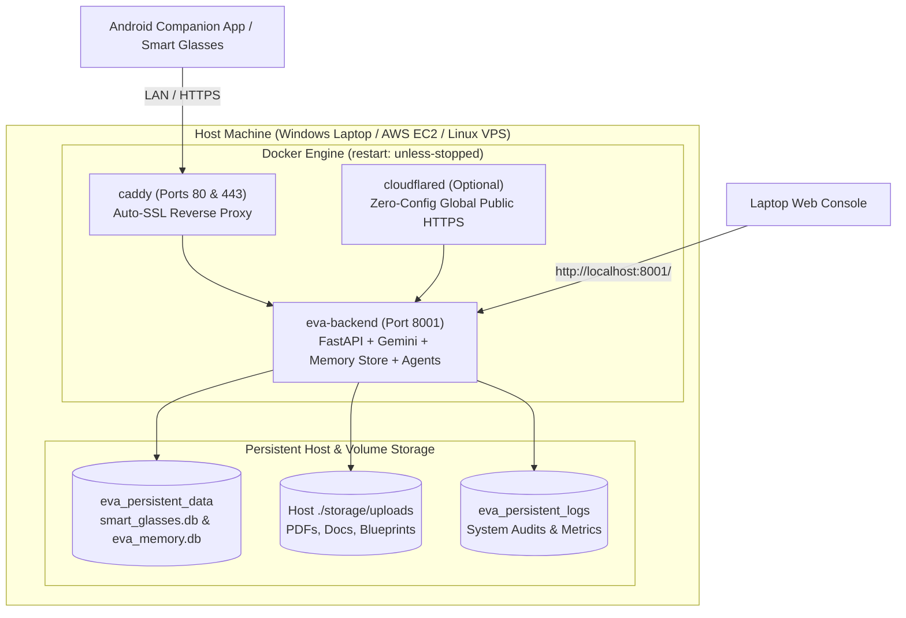

# EVA Smart Glasses AI — Permanent Docker Deployment Architecture

## 1. Overview & Permanence Strategy

The EVA Smart Glasses AI Assistant is designed to run **permanently (24/7/365)** using Docker and Docker Compose.



### Why This Setup is Permanent:
1. **Auto-Restart on Reboot**: Containers are configured with `restart: unless-stopped`. If your computer restarts, Docker automatically boots EVA back up without any manual intervention.
2. **Self-Healing Health Checks**: Docker performs automated healthchecks every 30 seconds against `/api/v1/health`. If a worker ever hangs or crashes, Docker automatically restarts it.
3. **Permanent Knowledge & File Persistence**: All SQLite databases (`smart_glasses.db`, `eva_memory.db`), uploaded files, and context logs are stored in dedicated Docker volumes (`eva_persistent_data` and `./storage/uploads`). Updating or rebuilding the container **never** deletes your memory records.

---

## 2. Quick Start Commands

### On Windows (PowerShell):
```powershell
# 1. Start the permanent container stack:
.\scripts\docker_start.ps1

# 2. View live container logs:
docker compose logs -f eva-backend

# 3. Stop containers gracefully:
.\scripts\docker_stop.ps1
```

### On Linux / macOS / AWS EC2 (Bash):
```bash
# 1. Make scripts executable:
chmod +x scripts/docker_start.sh scripts/docker_stop.sh

# 2. Start permanent stack:
./scripts/docker_start.sh

# 3. View live logs:
docker compose logs -f

# 4. Stop containers:
./scripts/docker_stop.sh
```

---

## 3. Endpoints & Access Points

| Component | URL | Purpose |
| :--- | :--- | :--- |
| **Web Console** | `http://localhost:8001/` | Product experience, memory studio, docs/contacts, settings |
| **Direct API** | `http://localhost:8001/api/v1/agent/message` | Agent chat & voice streaming endpoint |
| **Audio WebSocket** | `ws://localhost:8001/ws/audio` | Real-time audio streaming from glasses / phone |
| **Swagger Docs** | `http://localhost:8001/docs` | Interactive OpenAPI documentation |
| **Caddy Proxy** | `http://localhost:80/` | Production reverse proxy with gzip & zstd compression |
| **Health Check** | `http://localhost:8001/api/v1/health` | Container health probe |

---

## 4. Connecting Android Phone & Smart Glasses

### Option A: Local Wi-Fi / Hotspot (Zero Cloud Cost)
1. Find your computer's local Wi-Fi IP address (e.g., `192.168.1.45`).
2. In the Android App settings or `local.properties`, set:
   ```properties
   BASE_URL=http://192.168.1.45:8001/
   WS_URL=ws://192.168.1.45:8001/ws/audio
   ```
3. Your phone and glasses will talk directly to the permanent Docker backend on your local network.

### Option B: Cloudflare Tunnel (Instant Global Secure Public URL)
If you want to access EVA outside your home Wi-Fi:
1. In `docker-compose.yml`, start the Cloudflare tunnel profile:
   ```bash
   docker compose --profile tunnel up -d
   ```
2. Put your Cloudflare Tunnel Token in `.env` as `CLOUDFLARE_TUNNEL_TOKEN`.
3. You get an instant public `https://eva.yourdomain.com` without port forwarding or static IP.

---

## 5. Updating the Codebase Without Losing Memory

When you add new features or update code:
```bash
# Rebuild the image and restart seamlessly:
docker compose up -d --build
```
Your SQLite databases (`smart_glasses.db`, `eva_memory.db`) and uploaded files are preserved in the `eva_persistent_data` volume.
